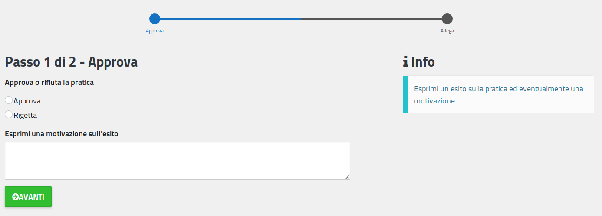

.. _h69337834651c687b27707522a605860:

Stanza del Cittadino: Manuale d’uso per il cittadino
****************************************************

Revisioni:

Versione iniziale: 17/12/2018

.. _h7c7331397930492c3e65695242d6467:

Manuale lato Cittadino:
=======================

Cos’è:

La SDC è un sistema che permette ai cittadini di usufruire di alcuni servizi messi a disposizione da un comune che ha aderito. Ogni comune che aderisce alla SDC è un ambiente isolato e autonomo.

La SDC permette un uso molto limitato agli utenti anonimi. La maggior parte delle funzionalità è riservata agli utenti autenticati

.. _h564f1d5e345f7b466a451a068575869:

Parte accessibile anonimamente
------------------------------

L’accesso alla SDC è possibile senza autenticazione solo selezionare un comune o per consultare l’elenco dei servizi messi a disposizione da un singolo comune

La prima pagina che viene proposta è quella per scegliere il comune sul quale operare, partendo da quelli disponibili:

\ |IMG1|\ 

Selezionando un comune (cliccando sul link blu con il nome del comune) si entra nell’applicazione specifica, dove sono elencati i servizi messi a disposizione.

Ogni comune può attivare o meno i servizi esistenti a sistema, quindi la lista che il cittadino trova può essere diversa per ogni comune

\ |IMG2|\ 

\ |IMG3|\ 

Per ogni servizio è disponibile una descrizione che è accessibile liberamente cliccando sul nome del servizio (es: \ |IMG4|\  ) o sul tasto vai al servizio (es: 

Nella pagina di descrizione del servizio sono disponibili:

#. Nome e descrizione del flusso relativo al servizio

#. Elenco dei servizi simili per area

#. Pulsante per accedere al servizio vero e proprio

\ |IMG6|\ 

La descrizione del servizio ( indicata col numero 1 nell’immagine ) permette di sapere in anticipo cosa succede aderendo al servizio e quali possono essere le aspettative del cittadino

I link dell’elenco servizi simili ( indicati col numero 2 nell’immagine ) portano ai servizi corrispondenti, rendendo più agevole la navigazione e la scoperta dei servizi messi a disposizione

Il pulsante per accedere al servizio ( indicati col numero 3 nell’immagine ) permette l’accesso al servizio vero e proprio, previa autenticazione.

Tutte le altre funzionalità sono disponibili solo previa autenticazione

.. _h756172375a323303e541f4a75353e6d:

Accettazione delle condizioni di utilizzo
-----------------------------------------

Al primo accesso ad un servizio, dopo essersi autenticati, si arriva su una pagina che richiede obbligatoriamente di accettare le condizioni di utilizzo del sito

\ |IMG7|\ 

Questa pagina viene mostrata in due occasioni:

* Al primo utilizzo di un qualsiasi servizio

* Quando le condizioni di utilizzo del sito sono cambiate

Basta accettare le condizioni una volta. Il sistema salva data e ora dell’accettazione delle condizioni e non chiede più conferma fin quando non ce ne dovessero essere di nuove.

Nella pagina di profilo è possibile consultare le condizioni di utilizzo che si sono accettate, e quando lo si è fatto.

.. _h206d48325c65547c5664274311b26:

Completamento dati di profilo
-----------------------------

Al primo accesso dopo l’autenticazione con SPID il sito richiede di completare i dati del proprio profilo. Da SPID vengono recuperati pochi dati, per quelli mancanti serve un inserimento manuale

\ |IMG8|\ 

.. _h6d4a7163494537403a50c1a33232e65:

Parte accessibile previa autenticazione
---------------------------------------

La SDC espone la maggior parte delle funzionalità previa autenticazione

Oltre ai servizi sono disponibili delle aree personali dove poter verificare  lo stato delle proprie pratiche, i propri allegati, i propri dati personali e un insieme di avvisi e scadenze di interesse

Le aree disponibili sono:

La mia stanza

Il mio profilo

Le mie pratiche

I miei Allegati

.. _h633b1464f3a771f746a485e27c3512:

Chiusura della sessione autenticata:
~~~~~~~~~~~~~~~~~~~~~~~~~~~~~~~~~~~~

Quando si è autenticati appare in alto a destra un link che permette di terminare la sessione corrente (logout).

Seguendolo si termina la sessione corrente e si viene riportati alla pagina principale 

\ |IMG9|\ 

.. _h1977532e797170515a6e3e5d645b6e38:

La mia stanza:
~~~~~~~~~~~~~~

Ne “La mia stanza” sono elencate informazioni di interesse per il cittadino come ad esempio scadenze relative al cittadino (provenienti da informazioni del comune), Avvisi e notizie relativi al comune, i servizi in primo piano in quanto più interessanti per il cittadino secondo la SDC, l’elenco delle pratiche più recenti.

Ogni elemento ha un elemento interattivo (link o pulsante) che permette di eseguire l’azione associata. Alcuni elementi possono prevedere la navigazione verso risorse esterne alla SDC

\ |IMG10|\ 

\ |IMG11|\ 

.. _h134442329454e2e67ed1d1559335f:

I miei Allegati:
~~~~~~~~~~~~~~~~

\ |IMG12|\ 

In questa sezione vengono mostrati gli allegati caricati nel sistema.

Per ognuno viene fornito un tasto che ne permette il download, il nome del file e la descrizione.

Se il file è stato allegato ad una pratica inviata alla protocollazione viene mostrata anche la/le pratica/pratiche relative e il loro stato. Il nome della pratica è un link.

Seguendo quel link si arriva alla visualizzazione di dettaglio della singola pratica

.. _h284775326b713624466181b58265230:

Dettaglio pratica:
~~~~~~~~~~~~~~~~~~

Nella parte alta della schermata sono presentati 

#. Lo stato corrente della pratica e i tasti per scaricare la risposta dell’ente alla pratica e l’eventuale file allegato (normalmente il certificato emesso, con formato p7m firmato digitalmente). Questa parte è presente solo se l’iter della pratica è concluso.

#. il tasto per scaricare il modulo compilato inviato effettivamente all’ente per la protocollazione, con il numero di protocollo relativo (in caso la protocollazione sia ancora in corso viene mostrato un avvertimento che dice che la pratica è in attesa di protocollazione)

#. L’iter della pratica, con riportati tutti gli stati che la pratica ha passato fino a quel momento, comprensivi di data e ora relativa \ |IMG13|\ al passaggio di stato

Nella parte bassa della schermata sono presentati:

\ |IMG14|\ 

\ |IMG15|\ 

#. il riassunto dei dati inviati assieme alla pratica e se presenti file allegati un elenco degli stessi, con un tasto per poterli scaricare

#. Una finestra di chat per parlare direttamente col personale del comune (se la funzionalità è stata richiesta ed attivata dal comune)

.. _h1b3a6a355a5f6e5648a3818301d2d30:

Esempio di modulo compilato:
~~~~~~~~~~~~~~~~~~~~~~~~~~~~

I moduli compilati si presentano con questo aspetto:

\ |IMG16|\ 

.. _h6766226d67352371596bb7cf3bd:

Comunicazioni provenienti dalla Stanza del cittadino:
~~~~~~~~~~~~~~~~~~~~~~~~~~~~~~~~~~~~~~~~~~~~~~~~~~~~~

Per ogni cambio di stato rilevante la Stanza del cittadino invia un messaggio via email al cittadino interessato (se è disponibile un recapito email valido). La comunicazione ha questo formato:

\ |IMG17|\ 

Contiene un link che se seguito porta al dettaglio della pratica. Ovviamente per arrivare a vedere il dettaglio della pratica serve essere autenticati. Se non si ha una sessione di autenticazione SPID aperta e valida si verrà come prima cosa portati al sistema di autenticazione

.. _h604768152563757318344c2b292ac:

Le mie pratiche:
~~~~~~~~~~~~~~~~

\ |IMG18|\ 

In questa sezione viene presentata la lista delle pratiche aperte dal cittadino direttamente, o per suo conto.

Le pratiche sono suddivise fra gli stati: In bozza, Inviate, In Elaborazione, Accettate, Rifiutate, Da integrare, Aperte per mio conto

Per ogni pratica vengono mostrati dei dati sommari, l’eventuale numero di protocollo e un pulsante che permette di andare alla pagina di dettaglio della pratica.

Cliccando su ognuno degli stati elencati la tabella viene aggiornata mostrando le pratiche corrispondenti

.. _h226283f224a295217291d2d477f72e:

Come si compila una pratica:
~~~~~~~~~~~~~~~~~~~~~~~~~~~~

Ogni servizio prevede step di compilazione generici (uguali per tutti) e specifici del servizio

Alcuni servizi prevedono l’invio di allegati o un pagamento

La compilazione prende avvio dalla pagina di elenco dei servizi attivi.

Si seleziona il servizio di interesse e si arriva alla pagina di spiegazione del servizio (precedentemente mostrata)

\ |IMG19|\ 

In caso sia previsto un pagamento viene mostrato un avvertimento specifico

Si preme il pulsante per accedere al servizio e si inizia la compilazione

Se a sistema è già presente una bozza di compilazione per lo stesso servizio per il proprio utente viene proposto di riprendere la compilazione della bozza

\ |IMG20|\ 

in generale è possibile avere una sola bozza per volta per ogni singolo servizio

Fanno eccezione i servizi come la SCIA orientati ai professionisti, per i quali può essere aperto un numero illimitato di bozze

L’interfaccia di compilazione presenta degli elementi comuni ad ogni servizio:

#. elenco degli step da eseguire per completare la compilazione della pratica, con visualizzazione dello step corrente, degli step eseguiti e degli step da eseguire.

#. un form per l’inserimento (o convalida) dei dati che vengono immessi nella pratica. Questa parte è specifica di ogni step del singolo servizio. Può essere composta da campi di testo, campi data, campi per l’upload dei file o campi disabilitati qualora i dati non siano modificabili dall’utente

#. Una guida alla compilazione che specifica cosa deve fare il cittadino per compilare lo step corrente

#. Un campo note ad uso libero del cittadino. non è visibile da nessun altro ed è specifico della singola pratica. Ogni pratica può avere note diverse. Si può inserire solo testo semplice per una lunghezza massima di 2000 caratteri

\ |IMG21|\ 

Nella parte bassa di ogni step di compilazione vengono presentati dei pulsanti che permettono di navigare fra gli step di compilazione:

\ |IMG22|\ 

Il tasto “INDIETRO” (non presente nel primo step) permette di tornare allo step precedente per modificare i dati inseriti (se lo step prevede inserimento di dati)

Il tasto “RICOMINCIA” riporta l’utente all’inizio della compilazione della pratica. I dati sono mantenuti

Il tasto “AVANTI” invia i dati immessi, che vengono validati. In caso di dati non validi viene mostrato un messaggio di errore e la compilazione rimane allo step corrente.

In alcuni casi (ad esempio lo step di pagamento) il tasto “AVANTI” risulta disabilitato fino a che il sistema non ha verificato l’avverarsi di una condizione (ad esempio l’effettivo pagamento registrato dai sistemi di pagamento esterni)

\ |STYLE0|\ 

Passo 1 con accettazione delle istruzioni riguardanti la procedura. Viene presentato un testo con le istruzioni riguardo la procedura. L’accettazione delle istruzioni è obbligatoria per procedere.

Essendo il primo step di compilazione non sono presenti i tasti “Indietro” e “Ricomincia”

\ |IMG23|\ 

Passo 2 con verifica dei dati utente:

Sono presentati i dati utente che saranno immessi nella pratica.

I dati non sono modificabili tramite questa maschera.

Alcuni dati utente sono modificabili attraverso la sezione “Il Mio Profilo”

\ |IMG24|\ 

Passo finale con verifica dati inseriti:

L’ultimo passo è la verifica dei dati inseriti (mostrati a schermo) che saranno inviati effettivamente una volta premuto il pulsante “INVIA”

\ |IMG25|\ 

Se i dati non sono corretti si può tornare indietro negli step di compilazione e correggere i dati errati.

Se invece i dati risultano corretti si può premere il pulsante “INVIA”

\ |IMG26|\ 

Una volta premuto il pulsante “INVIA” appare un elemento che chiede conferma

\ |IMG27|\ 

In caso positivo premere il pulsante “SÌ, SONO SICURO” per effettuare l’invio

Si arriva a quel punto alla pagina di dettaglio della pratica, dove viene riportato lo stato corrente. Fare riferimento al punto “Dettaglio pratica” per ulteriori informazioni

.. _hf7212141f55402a1330706022122a24:

Stanza del Cittadino: Manuale d’uso per l’operatore comunale
************************************************************

Come operatore comunale non ci sono parti accessibili anonimamente, tranne la pagina di login

Per accedere si può usare il link presente nel footer del sito (in basso a destra, punto 1)

\ |IMG28|\ 

Questo porta alla schermata di login

\ |IMG29|\ 

Le credenziali vengono fornite a cura dell’amministrazione dell’ente. Non esiste una modalità di registrazione autonoma

Una volta immesse le credenziali corrette si entra nell’area operatori

.. _h1f10266a3f1c50930362523243a5c41:

Parte accessibile previa autenticazione:
----------------------------------------

L’area operatori ha due pagine principali:

* Pannello di controllo

* Configurazione di protocollo (read-only)

.. _h633b1464f3a771f746a485e27c3512:

Chiusura della sessione autenticata:
~~~~~~~~~~~~~~~~~~~~~~~~~~~~~~~~~~~~

Quando si è autenticati appare in alto a destra un link che permette di terminare la sessione corrente (logout).

Seguendolo si termina la sessione corrente e si viene riportati alla pagina principale 

\ |IMG30|\ 

.. _h47271f717f1e5426a11a301b6e626c:

Home page operatori (Pannello di controllo):
~~~~~~~~~~~~~~~~~~~~~~~~~~~~~~~~~~~~~~~~~~~~

Il pannello di controllo presenta una lista delle pratiche relative all’utente che si è loggato

Sono le pratiche dei servizi per i quali è abilitato l’utente corrente

Le pratiche sono suddivise (punto 2) per stato di lavorazione:

* Pratiche da gestire (assegnate all’operatore corrente e non ancora evase)

* Pratiche da assegnare (inviate dal cittadino e non ancora prese in carico)

* Pratiche concluse (evase in senso positivo o negativo)

* Tutte le pratiche dell’ente (tutte le pratiche indipendentemente dallo stato)

Per ogni tipologia viene presentato il conteggio degli elementi

La tabella è filtrabile tramite casella di ricerca e le colonne sono ordinabili per un criterio a scelta

\ |IMG31|\ 

Per le pratiche da gestire e quelle concluse c’è un pulsante “VEDI DETTAGLIO” per ogni riga.

Questo pulsante porta alla visualizzazione della pratica in dettaglio (spiegata più avanti)

Per le pratiche da assegnare c’è un pulsante “PRENDI IN CARICO” per ogni riga

Premendo questo pulsante viene visualizzato un dialogo di conferma per prendere in carico la pratica

\ |IMG32|\ 

Se si risponde “SÌ, SONO SICURO” la pratica viene assegnata per la lavorazione al proprio utente e appare fra quelle “Da gestire”. Si viene portati alla visualizzazione di dettaglio della pratica

Prendendo in carico una pratica viene inviata una email automatica al cittadino, come per ogni cambio di stato rilevante

La comunicazione che arriva è simile a questa:

\ |IMG33|\ 

La stanza del cittadino non comunica esplicitamente i dati dell’operatore che compie un’operazione

.. _h284775326b713624466181b58265230:

Dettaglio pratica:
~~~~~~~~~~~~~~~~~~

\ |IMG34|\ 

Nella parte alta della schermata sono presentati 

#. Il pulsante per accedere alla gestione effettiva della pratica

#. Lo stato corrente della pratica e i tasti per scaricare il modulo compilato inviato effettivamente all’ente per la protocollazione, con il numero di protocollo relativo (in caso la protocollazione sia ancora in corso viene mostrato un avvertimento che dice che la pratica è in attesa di protocollazione)

#. L’iter della pratica, con riportati tutti gli stati che la pratica ha passato fino a quel momento, comprensivi di data e ora relativa al passaggio di stato

Nella parte bassa della schermata sono presentati:

\ |IMG35|\ 

\ |IMG36|\ 

#. il riassunto dei dati inviati assieme alla pratica e se presenti file allegati un elenco degli stessi, con un tasto per poterli scaricare

#. Una finestra di chat per parlare direttamente col personale del comune (se la funzionalità è stata richiesta ed attivata dal comune)

.. _h226283f224a295217291d2d477f72e:

Come si compila una pratica:
~~~~~~~~~~~~~~~~~~~~~~~~~~~~

Ogni servizio prevede step di compilazione generici (uguali per tutti) e specifici del servizio

Il flusso di compilazione standard prevede due step: 

#. approvazione/rifiuto

#. upload del file di risposta

\ |IMG37|\ 

\ |IMG38|\ 

Una volta completato l’iter viene inviata una emal al cittadino per avvertirlo che è pronto l’esito della pratica. La pratica viene spostata in quelle concluse

A conclusione della lavorazione viene creato un file di risposta dal sistema:

\ |IMG39|\ 

Oltre a questo viene reso disponibile al cittadino l’eventuale file allegato dall’operatore negli step precedenti

\ |IMG40|\ 

.. _h4f59427e624066520616442b2e2c4e:

Configurazione di protocollo (read-only):
~~~~~~~~~~~~~~~~~~~~~~~~~~~~~~~~~~~~~~~~~

Questa pagina mostra in maniera molto schematica i valori di protocollo impostati per ogni servizio. Per modificarli contattare l’assistenza

.. _h25694238714c5822634a7c1f307d5f4f:

API
===

La Stanza del Cittadino espone delle  API REST per permettere l’interoperabilità con fornitori di terze parti. 

Le funzionalità esposte sono relative agli stati delle pratiche, alla creazione di specifici tipi di pratica, alla modifica delle schede servizio, alla consultazione dei servizi abilitati

L’accesso via API richiede autenticazione HTTP Basic su protocollo https

Alternativamente è possibile richiedere l’autenticazione tramite certificati crittografici

POST /api/v1.0/$partner/pratica/offline/create (implementazione specifica per partner)

Permette la creazione di un tipo specifico di pratica per il singolo partner.

L’integrazione va pianificata e richiede una fase di sviluppo di codice e testing.

Un caso d’uso sono le pratiche SCIA

I dati necessari all’apertura della pratica vengono definiti di volta in volta

POST /api/v1.0/$partner/pratica/{pratica}/status { evento, operatore, responsabile, struttura, timestamp }

Permette ad un partner di modificare lo stato di una pratica, in base al flusso di lavorazione.

I cambi di stato sono stabiliti d’accordo con il partner. La validità del cambio di stato viene valutata dal sistema. In caso di cambi di stato non permessi o non riconosciuti la risposta è negativa

POST /api/v1.0/$partner/pratica/{pratica}/protocolli {[protocolli] }

Permette ad un partner di salvare una serie arbitraria di informazioni di protocollo relative alla pratica. Non viene effettuata nessuna particolare validazione semantica sui valori passati

	

GET/POST /api/v1.0/schedaInformativa/{servizio}/{ente}

Permette di inviare e consultare previa autenticazione le schede informative per un servizio specifico

POST /api/v1.0/servizioTexts/{servizio}/{ente}/{step}

Permette di impostare un testo specifico per uno step di compilazione di un servizio specifico. Il testo viene mostrato dopo il testo generico

GET /api/v1.0/services

Permette di consultare l’elenco dei servizi attivati e disponibili

.. bottom of content

.. |STYLE0| replace:: **Step comuni a tutti i servizi con immissione di dati:**

.. |IMG16| image:: static/Stanza_del_Cittadino_-_Manuale_16.png
   :height: 700 px
   :width: 601 px

.. |IMG17| image:: static/Stanza_del_Cittadino_-_Manuale_17.png
   :height: 260 px
   :width: 601 px

.. |IMG18| image:: static/Stanza_del_Cittadino_-_Manuale_18.png
   :height: 226 px
   :width: 601 px

.. |IMG33| image:: static/Stanza_del_Cittadino_-_Manuale_17.png
   :height: 260 px
   :width: 601 px

.. |IMG39| image:: static/Stanza_del_Cittadino_-_Manuale_35.png
   :height: 217 px
   :width: 601 px

.. |IMG40| image:: static/Stanza_del_Cittadino_-_Manuale_16.png
   :height: 700 px
   :width: 601 px
