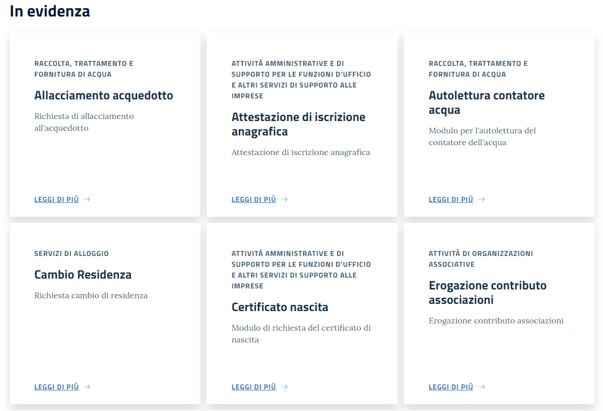

.. _h5f667d540801b12113687151722f7:

Manuale per il cittadino
========================

.. _h51f23337b523c347794c464f6a611d:

Seleziona una Stanza del Cittadino
----------------------------------

Accedi al sito della Stanza del Cittadino (\ |LINK1|\ ) e seleziona la stanza del Comune entro la quale desideri operare (per selezionare una stanza clicca sul link blu con il nome del Comune).

In questo modo entrerai nell’applicazione specifica e potrai consultare l’elenco dei servizi messi a disposizione dal tuo Comune.

+--------------------------------------------------------------------------------------------------------------------------------------------------------------------------------------------------------+
|Nota                                                                                                                                                                                                    |
+--------------------------------------------------------------------------------------------------------------------------------------------------------------------------------------------------------+
|Senza esserti autenticato puoi soltanto selezionare un Comune e consultare l’elenco dei servizi messi a disposizione da un singolo comune. Per accedere ai servizi, invece, è necessaria l’\ |STYLE0|\ .|
+--------------------------------------------------------------------------------------------------------------------------------------------------------------------------------------------------------+

\ |IMG1|\ 

+---------------------------------------------------------------------------------------------------------------------------------------------------------------------------+
|Attenzione                                                                                                                                                                 |
+---------------------------------------------------------------------------------------------------------------------------------------------------------------------------+
|Ogni Comune può aver attivato soltanto alcuni dei servizi esistenti a sistema, motivo per cui la lista dei servizi messi a disposizione può essere diversa per ogni Comune.|
+---------------------------------------------------------------------------------------------------------------------------------------------------------------------------+

.. _h1f2c644a3e59c4d197d167e4b707158:

Consulta l’elenco dei servizi
-----------------------------

Dopo aver selezionato il Comune entro il quale desideri operare, entrerai in una pagina che ti permetterà di consultare l’elenco dei servizi messi a disposizione dal Comune selezionato.

\ |IMG2|\ 

Per ogni servizio è disponibile una descrizione, accessibile liberamente cliccando sul nome del servizio o sul tasto”Leggi di più”.

\ |IMG3|\ 

Nella pagina di descrizione del servizio sono disponibili:

#. il nome e la descrizione del servizio

#. l’elenco dei servizi appartenenti alla stessa area

#. il pulsante per accedere al servizio vero e proprio

\ |IMG4|\ 

La descrizione del servizio (1) permette di sapere in anticipo cosa succede aderendo al servizio e quali possono essere le aspettative del cittadino.

I link dell’elenco servizi simili (2) portano ai servizi corrispondenti, rendendo più agevole la navigazione e la scoperta dei servizi messi a disposizione.

Il pulsante per accedere al servizio (3) permette l’accesso al servizio vero e proprio, previa autenticazione.

Tutte le altre funzionalità sono disponibili solo previa autenticazione.

.. _h4671d2950371a24167b355f4a2d2d2d:

Autènticati
-----------

La Stanza del Cittadino espone la maggior parte delle funzionalità previa autenticazione

Oltre ai servizi, sono disponibili delle aree personali dove poter verificare lo stato delle proprie pratiche, i propri allegati, i propri dati personali e un insieme di avvisi e scadenze di interesse.

\ |IMG5|\ 

Le aree disponibili sono:

* La mia stanza

* Tutti i servizi

* Le mie pratiche

* Il mio profilo

* I miei allegati

.. _hd77461b583232d49253b8061432716:

Accetta le condizioni di utilizzo
---------------------------------

Al primo accesso ad un servizio, dopo essersi autenticati, si arriva su una pagina che richiede obbligatoriamente di accettare le condizioni di utilizzo del sito.

\ |IMG6|\ 

Questa pagina viene mostrata in due occasioni:

* al primo utilizzo di un qualsiasi servizio

* quando le condizioni di utilizzo del sito sono cambiate

Basta accettare le condizioni una volta. Il sistema salva data e ora dell’accettazione delle condizioni e non chiede più conferma fin quando non ce ne dovessero essere di nuove.

Nella pagina di profilo è possibile consultare le condizioni di utilizzo che si sono accettate, e quando lo si è fatto.

.. _h56441e4f5a4571532528375b5c654c50:

Completa i dati del tuo profilo
-------------------------------

Al primo accesso dopo l’autenticazione con SPID il sito richiede di completare i dati del proprio profilo. Da SPID vengono recuperati alcuni dati, per quelli mancanti serve un inserimento manuale.

Compila i campi richiesti e, infine, clicca su “Salva informazioni profilo”.

\ |IMG7|\ 

\ |IMG8|\ 

Per accedere ai dati del tuo profilo e modificarli anche in un momento successivo, clicca sul pulsante “Il mio profilo”.

\ |IMG9|\ 

.. _h2c1d74277104e41780968148427e:

.. _h246782c72670fd5564117c236d7d:

Compila una pratica
-------------------

Ogni servizio prevede step di compilazione generici (uguali per tutti) e specifici del servizio

Alcuni servizi prevedono l’invio di allegati o un pagamento.

La compilazione prende avvio dalla pagina di elenco dei servizi attivi.

Si seleziona il servizio di interesse e si arriva alla pagina di descrizione del servizio (come visto sopra).

\ |IMG10|\ 

In caso sia previsto un pagamento viene mostrato un avvertimento specifico.

A questo punto, premi il pulsante per accedere al servizio e inizia la compilazione.

Se all’interno del sistema è già presente una bozza di compilazione per lo stesso servizio viene proposto di riprendere la compilazione della bozza

\ |IMG11|\ 

In generale è possibile avere una sola bozza per volta per ogni singolo servizio

Fanno eccezione i servizi come la SCIA orientati ai professionisti, per i quali può essere aperto un numero illimitato di bozze.

L’interfaccia di compilazione presenta degli elementi comuni ad ogni servizio:

#. elenco degli step da eseguire per completare la compilazione della pratica, con visualizzazione dello step corrente, degli step eseguiti e degli step da eseguire.

#. un form per l’inserimento (o convalida) dei dati che vengono immessi nella pratica. Questa parte è specifica di ogni step del singolo servizio. Può essere composta da campi di testo, campi data, campi per l’upload dei file o campi disabilitati qualora i dati non siano modificabili dall’utente

#. Una guida alla compilazione che specifica cosa deve fare il cittadino per compilare lo step corrente

#. Un campo note ad uso libero del cittadino. Non è visibile da nessun altro ed è specifico della singola pratica. Ogni pratica può avere note diverse. Si può inserire solo testo semplice per una lunghezza massima di 2000 caratteri.

\ |IMG12|\ 

Nella parte bassa di ogni step di compilazione vengono presentati dei pulsanti che permettono di navigare fra gli step di compilazione:

\ |IMG13|\ 

Il tasto “Indietro” (non presente nel primo step) permette di tornare allo step precedente per modificare i dati inseriti (se lo step prevede inserimento di dati)

Il tasto “Ricomincia” riporta l’utente all’inizio della compilazione della pratica. I dati sono mantenuti

Il tasto “Avanti” invia i dati immessi, che vengono validati. In caso di dati non validi viene mostrato un messaggio di errore e la compilazione rimane allo step corrente.

In alcuni casi (ad esempio lo step di pagamento) il tasto “Avanti” risulta disabilitato fino a che il sistema non ha verificato l’avverarsi di una condizione (ad esempio l’effettivo pagamento registrato dai sistemi di pagamento esterni)

.. _h3225225654171d39194a1d602d257d11:

Accetta le istruzioni riguardanti la procedura
~~~~~~~~~~~~~~~~~~~~~~~~~~~~~~~~~~~~~~~~~~~~~~

Viene presentato un testo con le istruzioni riguardo la procedura. L’accettazione delle istruzioni è obbligatoria per procedere.

Essendo il primo step di compilazione non sono presenti i tasti “Indietro” e “Ricomincia”

\ |IMG14|\ 

.. _h2c25461063e22a4b2a43254a1c544d:

Verifica i tuoi dati personali
~~~~~~~~~~~~~~~~~~~~~~~~~~~~~~

Sono presentati i dati utente che saranno immessi nella pratica.

I dati non sono modificabili tramite questa maschera.

Alcuni dati utente sono modificabili attraverso la sezione “Il Mio Profilo”

\ |IMG15|\ 

.. _h3c314758f6f1d614f4ce4254337e52:

Verifica i dati relativi alla compilazione
~~~~~~~~~~~~~~~~~~~~~~~~~~~~~~~~~~~~~~~~~~

L’ultimo passo è la verifica dei dati inseriti (mostrati a schermo) che saranno inviati effettivamente una volta premuto il pulsante “Invia”.

\ |IMG16|\ 

Se i dati non sono corretti si può tornare indietro negli step di compilazione e correggere i dati errati.

Se invece i dati risultano corretti si può premere il pulsante “Invia”.

Una volta premuto il pulsante “Invia” appare un elemento che chiede conferma.

\ |IMG17|\ 

In caso positivo premere il pulsante “Sì, sono sicuro” per effettuare l’invio.

Si arriva a quel punto alla pagina di dettaglio della pratica, dove viene riportato lo stato corrente. Fare riferimento al punto “Dettaglio pratica” per ulteriori informazioni.

.. _h3b6202d704358314e4e167c2c6f2a2f:

Accedi a “La mia stanza”
------------------------

Ne “La mia stanza” sono elencate informazioni di interesse per il cittadino come ad esempio \ |STYLE1|\  relative al cittadino (provenienti da informazioni del comune), \ |STYLE2|\  relativi al comune, i \ |STYLE3|\  in quanto più interessanti per il cittadino secondo la Stanza del Cittadino, l’elenco delle \ |STYLE4|\ .

\ |IMG18|\ 

Ogni elemento ha un elemento interattivo (link o pulsante) che permette di eseguire l’azione associata. Alcuni elementi possono prevedere la navigazione verso risorse esterne alla Stanza del Cittadino.

\ |IMG19|\ 

.. _h2c1d74277104e41780968148427e:

.. _h2c1d74277104e41780968148427e:

.. _h2c1d74277104e41780968148427e:

.. _h205c6e77381b345c75671875531e6278:

Visualizza i tuoi allegati
--------------------------

\ |IMG20|\ 

Nella sezione “I miei allegati” vengono mostrati gli allegati caricati nel sistema.

Per ognuno viene fornito un tasto che ne permette il download, il nome del file e la descrizione.

Se il file è stato allegato ad una pratica inviata alla protocollazione viene mostrata anche la/le pratica/pratiche relative e il loro stato. Il nome della pratica è un link.

Seguendo quel link si arriva alla visualizzazione di dettaglio della singola pratica.

.. _h23c36940484d6773713d1e6b125d57:

Visualizza il dettaglio della tua pratica
-----------------------------------------

Nella parte alta della schermata sono presentati 

#. Lo stato corrente della pratica e i tasti per scaricare la risposta dell’ente alla pratica e l’eventuale file allegato (normalmente il certificato emesso, con formato p7m firmato digitalmente). \ |STYLE5|\ .

#. il tasto per scaricare il modulo compilato inviato effettivamente all’ente per la protocollazione, con il numero di protocollo relativo (in caso la protocollazione sia ancora in corso viene mostrato un avvertimento che dice che la pratica è in attesa di protocollazione)

#. L’iter della pratica, con riportati tutti gli stati che la pratica ha passato fino a quel momento, comprensivi di data e ora relativa \ |IMG21|\ al passaggio di stato

.. _h7a6b767a413d13121581f4c7b5d7713:

Esempio di modulo compilato
~~~~~~~~~~~~~~~~~~~~~~~~~~~

I moduli compilati si presentano con questo aspetto:

\ |IMG22|\ 

.. _h6a4a4842353c38666e7c7f7d75c4b4c:

Comunicazioni provenienti dalla Stanza del cittadino
~~~~~~~~~~~~~~~~~~~~~~~~~~~~~~~~~~~~~~~~~~~~~~~~~~~~

Per ogni cambio di stato rilevante la Stanza del cittadino invia un messaggio via email al cittadino interessato (se è disponibile un recapito email valido). La comunicazione ha questo formato:

\ |IMG23|\ 

Contiene un link che se seguito porta al dettaglio della pratica. Ovviamente per arrivare a vedere il dettaglio della pratica serve essere autenticati. Se non si ha una sessione di autenticazione SPID aperta e valida si verrà come prima cosa portati al sistema di autenticazione

.. _h2f664347879615f2a377d271a6f1f:

Visualizza le tue pratiche
--------------------------

\ |IMG24|\ 

In questa sezione viene presentata la lista delle pratiche aperte dal cittadino direttamente, o per suo conto.

Le pratiche sono suddivise fra gli stati: In bozza, Inviate, In Elaborazione, Accettate, Rifiutate, Da integrare, Aperte per mio conto.

Per ogni pratica vengono mostrati dei dati sommari, l’eventuale numero di protocollo e un pulsante che permette di andare alla pagina di dettaglio della pratica.

Cliccando su ognuno degli stati elencati la tabella viene aggiornata mostrando le pratiche corrispondenti.

.. _h4439704725673e685b4d322aff923:

Esci dalla sessione autenticata
-------------------------------

Quando si è autenticati appare in alto a destra un link che permette di terminare la sessione corrente (logout).

Seguendolo si termina la sessione corrente e si viene riportati alla pagina principale 

\ |IMG25|\ 

.. bottom of content

.. |STYLE0| replace:: **autenticazione**

.. |STYLE1| replace:: **scadenze**

.. |STYLE2| replace:: **Avvisi e notizie**

.. |STYLE3| replace:: **servizi in primo piano**

.. |STYLE4| replace:: **pratiche più recenti**

.. |STYLE5| replace:: **Questa parte è presente solo se l’iter della pratica è concluso**

.. |LINK1| raw:: html

    <a href="https://stanzadelcittadino.it/" target="_blank">stanzadelcittadino.it</a>

.. |IMG11| image:: static/Manuale_per_il_cittadino_11.png
   :height: 349 px
   :width: 353 px

.. |IMG13| image:: static/Manuale_per_il_cittadino_13.png
   :height: 76 px
   :width: 313 px

.. |IMG22| image:: static/Manuale_per_il_cittadino_22.png
   :height: 700 px
   :width: 601 px

.. |IMG24| image:: static/Manuale_per_il_cittadino_24.png
   :height: 264 px
   :width: 624 px

