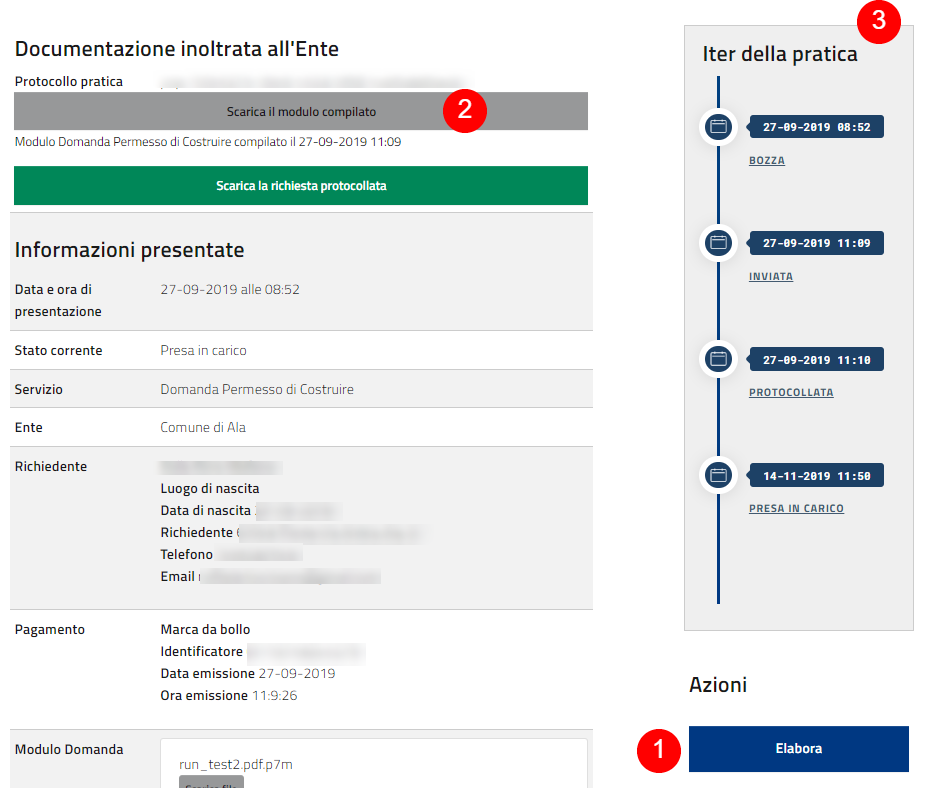

.. _h2c38693e311664255f434636465a153b:

Manuale per l’operatore comunale
================================

.. _h202a6a4d5f5d57b327356443f2446:

Accedi alla Stanza del Cittadino
--------------------------------

Come operatore comunale non ci sono parti accessibili anonimamente, tranne la pagina di login.

Per accedere si può usare il link presente nel footer del sito (in basso a destra, punto 1)

\ |IMG1|\ 

Questo porta alla schermata di login

\ |IMG2|\ 

Le credenziali vengono fornite a cura dell’amministrazione dell’ente. Non esiste una modalità di registrazione autonoma.

Una volta immesse le credenziali corrette si entra nell’area operatori, la quale ha tre pagine principali:

* Pannello di controllo

* Configurazione di protocollo (read-only)

* Metriche di utilizzo

\ |IMG3|\ 

.. _h2c1d74277104e41780968148427e:

.. _he5e10567a3d3f6f7e306a73744c7573:

Accedi al pannello di controllo
-------------------------------

Il pannello di controllo presenta una lista delle pratiche relative all’utente che si è loggato

Sono le pratiche dei servizi per i quali è abilitato l’utente corrente

Le pratiche sono suddivise (punto 2) per stato di lavorazione:

* Pratiche da gestire (assegnate all’operatore corrente e non ancora evase)

* Pratiche da assegnare (inviate dal cittadino e non ancora prese in carico)

* Pratiche concluse (evase in senso positivo o negativo)

* Tutte le pratiche dell’ente (tutte le pratiche indipendentemente dallo stato)

Per ogni tipologia viene presentato il conteggio degli elementi.

La tabella è filtrabile tramite casella di ricerca e le colonne sono ordinabili per un criterio a scelta

\ |IMG4|\ 

Per le pratiche da gestire e quelle concluse c’è un pulsante “Vedi dettaglio” per ogni riga.

Questo pulsante porta alla visualizzazione della pratica in dettaglio (spiegata più avanti).

Per le pratiche da assegnare c’è un pulsante “Prendi in carico” per ogni riga.

Premendo questo pulsante viene visualizzato un dialogo di conferma per prendere in carico la pratica

\ |IMG5|\ 

Se si risponde “Sì, sono sicuro” la pratica viene assegnata per la lavorazione al proprio utente e appare fra le“Pratiche da gestire”. Si viene portati alla visualizzazione di dettaglio della pratica.

Prendendo in carico una pratica viene inviata una email automatica al cittadino, come per ogni cambio di stato rilevante.

La comunicazione che arriva è simile a questa:

\ |IMG6|\ 

La stanza del cittadino non comunica esplicitamente i dati dell’operatore che compie un’operazione

.. _h4e4543015716f532e4032135b5756:

Visualizza il dettaglio della pratica
-------------------------------------

\ |IMG7|\ 

Nella parte alta della schermata sono presentati 

#. Il pulsante “Elabora” per accedere alla gestione effettiva della pratica

#. Lo stato corrente della pratica e i tasti per scaricare il modulo compilato inviato effettivamente all’ente per la protocollazione, con il numero di protocollo relativo (in caso la protocollazione sia ancora in corso viene mostrato un avvertimento che dice che la pratica è in attesa di protocollazione)

#. L’iter della pratica, con riportati tutti gli stati che la pratica ha passato fino a quel momento, comprensivi di data e ora relativa al passaggio di stato

.. _h4ca12365e384e376f3d6954275129:

Elabora una pratica
-------------------

Ogni servizio prevede step di compilazione generici (uguali per tutti) e specifici del servizio

Il flusso di compilazione standard prevede due step: 

#. approvazione/rifiuto

#. upload del file di risposta

\ |IMG8|\ 

\ |IMG9|\ 

Una volta completato l’iter viene inviata una email al cittadino per avvertirlo che è pronto l’esito della pratica. La pratica viene spostata in quelle concluse.

A conclusione della lavorazione viene creato un file di risposta dal sistema:

\ |IMG10|\ 

Oltre a questo viene reso disponibile al cittadino l’eventuale file allegato dall’operatore negli step precedenti.

\ |IMG11|\ 

.. _h7e55b2841174e7b1e5357e734245:

 Configurazione di protocollo (read-only):
------------------------------------------

Questa pagina mostra in maniera molto schematica i valori di protocollo impostati per ogni servizio. Per modificarli contattare l’assistenza.

.. _h14a3db33716553b7a7b3414153563:

Metriche di utilizzo
--------------------

\ |IMG12|\ 

.. _h4439704725673e685b4d322aff923:

Esci dalla sessione autenticata
-------------------------------

Quando si è autenticati appare in alto a destra un link che permette di terminare la sessione corrente (logout).

Seguendolo si termina la sessione corrente e si viene riportati alla pagina principale 

\ |IMG13|\ 

.. _h25694238714c5822634a7c1f307d5f4f:

API
---

La Stanza del Cittadino espone delle API REST per permettere l’interoperabilità con fornitori di terze parti. 

Le funzionalità esposte sono relative agli stati delle pratiche, alla creazione di specifici tipi di pratica, alla modifica delle schede servizio, alla consultazione dei servizi abilitati

L’accesso via API richiede autenticazione HTTP Basic su protocollo https

Alternativamente è possibile richiedere l’autenticazione tramite certificati crittografici

POST /api/v1.0/$partner/pratica/offline/create (implementazione specifica per partner)

Permette la creazione di un tipo specifico di pratica per il singolo partner.

L’integrazione va pianificata e richiede una fase di sviluppo di codice e testing.

Un caso d’uso sono le pratiche SCIA

I dati necessari all’apertura della pratica vengono definiti di volta in volta

POST /api/v1.0/$partner/pratica/{pratica}/status { evento, operatore, responsabile, struttura, timestamp }

Permette ad un partner di modificare lo stato di una pratica, in base al flusso di lavorazione.

I cambi di stato sono stabiliti d’accordo con il partner. La validità del cambio di stato viene valutata dal sistema. In caso di cambi di stato non permessi o non riconosciuti la risposta è negativa

POST /api/v1.0/$partner/pratica/{pratica}/protocolli {[protocolli] }

Permette ad un partner di salvare una serie arbitraria di informazioni di protocollo relative alla pratica. Non viene effettuata nessuna particolare validazione semantica sui valori passati

	

GET/POST /api/v1.0/schedaInformativa/{servizio}/{ente}

Permette di inviare e consultare previa autenticazione le schede informative per un servizio specifico

POST /api/v1.0/servizioTexts/{servizio}/{ente}/{step}

Permette di impostare un testo specifico per uno step di compilazione di un servizio specifico. Il testo viene mostrato dopo il testo generico

GET /api/v1.0/services

Permette di consultare l’elenco dei servizi attivati e disponibili

.. bottom of content

.. |IMG3| image:: static/Manuale_per_l'operatore_3.png
   :height: 73 px
   :width: 624 px

.. |IMG5| image:: static/Manuale_per_l'operatore_5.png
   :height: 122 px
   :width: 393 px

.. |IMG6| image:: static/Manuale_per_l'operatore_6.png
   :height: 260 px
   :width: 601 px

.. |IMG11| image:: static/Manuale_per_l'operatore_11.png
   :height: 700 px
   :width: 601 px

